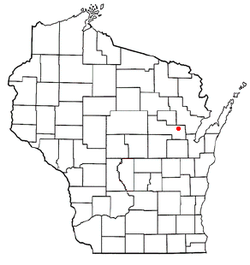
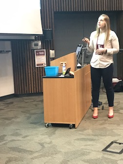

## Background

Hi! Welcome to my page. My name is Amanda Skarlupka, and I am a graduate student in the department of infectious diseases at UGA. I was born in Arizona, but grew up in Northern Wisconsin. My hometown is Cecil, WI.   
 

One interesting fact about me is that I enjoy physical activity. I bike to campus everyday and try to use the stairs over the elevator. I have ran a 20k and the AthHalf this past spring with a few smaller races. I'm doing a 10K trail run at the end of September. When I have a lot of extra time I will rock climb. But I enjoy lifting the most. I compete in the USA Powerlifting meets, with my favorite of the three lifts (squat, bench, deadlift) being the deadlift. 

## Research Training

+ University of Wisconsin  
  At Madison I recieved my bachelors in Microbiology and in Botany. I did research in a fungal genetics lab focusing on using filamentous fungus for bioremediation of superfund soil.

+ Food Research Institute  
  After graduation, I worked at the Food Research Institute (FRI) at UW for two years. There I focused on applied food microbiology. My projects included challenge studies of commercial food products with common food-borne pathogens such as *E.coli*, *Clostridium botulinum*, and *Listeria monocytogenes*. I learned a lot at the FRI; I now know what bot contaminated food smells like, and I won't eat anything that came from a bloated packaged...which seems like common sense. But surprisingly, many cases of food poisoning can be traced back to the victim saying something along the lines of "...well I thought is smelled/tasted/looked weird but I ate it anyways." I still however will eat certain delicacies and just accept the risk of infection. Where I'm from in Wisconsin we have for the holidays and special get-togethers a raw beef dish that goes by many names: cannibal sandwich, wildcat, tiger meat, or steak tartare. And fun fact! [The CDC has asked that specifically midwesterners stop eating this.](https://www.vice.com/en_us/article/nepmmq/cdc-yet-again-implores-midwesterners-to-stop-eating-raw-ground-beef) 

+ University of Georgia  

  Since coming to UGA in 2016, I have worked in two different labs. 
  
  + Harvill Lab  
  In the Harvill lab I worked with *Bordetella* spp. I was involved in characterizing the newly identified *B. pseudohinizii* which is able to naturally infect and transmit among mice ulitmately leading to ear infections. We proposed this as a natural model for the clinical disease of otitis media.  

  + Ross Lab  
  In the Ross lab I have worked on many different projects. My area of expertise includes swine influenza H1, the neuraminidase, and characterization of the HA and NA antigenic sites. As of now, my focus is on the creation of a computationally optimized broadly reactive antigen (COBRA) neuraminidase protein vaccine. My end goal is to create a broadly-protective influenza vaccine. 
  
Over the course of all this research experience, my statistics and data analysis background is lacking. I have done the basic stats for my experiments by using either Excel or, more recently, Prism. During my graduate career I have become more interested in learning how to visualized data in different ways as a means to generate different hypothesis or questions. I feel as though data analysis is not valued enough, and that many scientists don't even understand the basics stats being used. Therefore, I have started learning these methods. At UGA, I have only taken BIOS 7010. I am currently reading [_Intuitive Biostatistics_](https://www.amazon.com/Intuitive-Biostatistics-Nonmathematical-Statistical-Thinking/dp/0190643560/ref=sr_1_1?crid=1YM6EWD7TG5J4&keywords=intuitive+biostatistics&qid=1565972685&s=gateway&sprefix=intuitive+bio%2Caps%2C145&sr=8-1) written by Harvey Motulsky (the creator of Graphpad Prism). I highly recommend the book; it is a very easy and enjoyable read, but still contains a lot of applicable information. I have no background in programming or coding. I am hoping that this course will help me become more comfortable with computational biology and visualization. 

